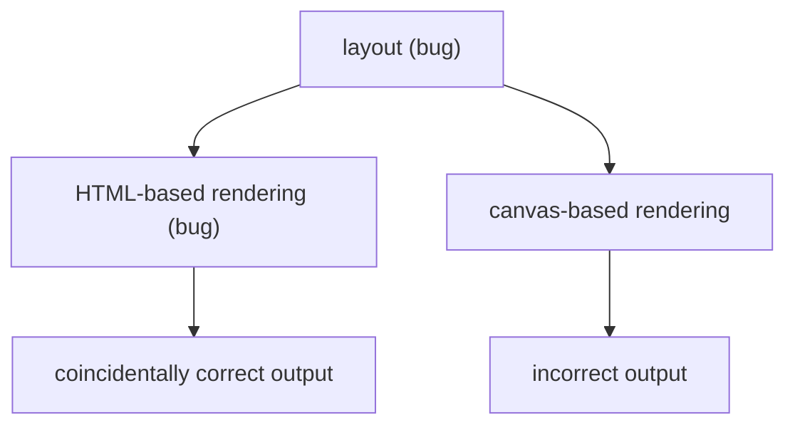

I encountered a perplexing bug while implementing
[table cell splitting in Google Docs](https://workspaceupdates.googleblog.com/2022/10/split-table-cells-in-google-docs.html).

## The bug report 🐛

The QA team found a bug where some of a table's borders would be missing after a
table cell split in certain scenarios. However, the borders reappeared when
refreshing the page. That meant the document's data was likely stored correctly
and that [incremental](https://en.wikipedia.org/wiki/Incremental_computing)
layout or rendering had a bug.

## The investigation 🕵️

At the time, the team was
[migrating Google Docs from HTML-based rendering to canvas-based rendering](https://workspaceupdates.googleblog.com/2021/05/Google-Docs-Canvas-Based-Rendering-Update.html).
QA reported the bug about a canvas-rendered document, which made me suspect it
was a bug in canvas-based rendering. So I tried to reproduce the issue on an
HTML-rendered document and it didn't reproduce!

At this point I concluded the new canvas-based rendering must have a bug. Oh how
wrong I was... After _much_ investigation, I realized canvas-based rendering was
correct.

## Two bugs 🐛🪲

In Google Docs, the output of layout is the input for rendering. It turned out
layout had a bug and canvas-based rendering was correctly displaying layout's
incorrect output. So why did HTML-based rendering look correct? It turned out
that HTML-based rendering **_also_** had a bug, and the bug coincidentally
"fixed" layout's output so that the final output looked correct.

## How? 🤔

So how did the HTML-based rendering bug cancel out the layout bug? One of the
reasons the team switched to canvas-based rendering, other than better
performance, is that it's more precise than HTML-based rendering.

With canvas-based rendering you effectively have to specify the location of
every pixel, which means it can accurately render any layout. It did just that
for the incorrect layout output!

On the other hand, with HTML-based rendering a table is rendered using a
[`table` element](https://developer.mozilla.org/en-US/docs/Web/HTML/Element/table),
which supports a limited set of layouts. HTML-based rendering could not
faithfully render the incorrect layout output so it rendered the closest thing,
which coincidentally looked correct.
