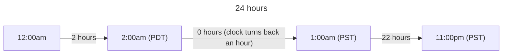

:::note

This article was updated in response to some helpful comments on
[Hacker News](https://news.ycombinator.com/item?id=41267894). I originally
incorrectly formatted the Pacific Time Zone daylight saving times relative to
the Eastern Time Zone!

:::

The date was November 8, 2021 and I was a
[bug triager](https://en.wikipedia.org/wiki/Bug_triage) on the Google Docs team.
That day began like any other. I made myself some coffee and started looking
through bug reports from the day before. But then something caught my eye.

## The bug reports 🐛

There were an unusually large number of bugs reported and they all said the same
thing. The user had created a reply or new comment in a Doc, but its timestamp
in the UI said it had been created "tomorrow".

## The pattern 🌐

A pattern quickly emerged. These bugs were all reported:

- By users in the
  [Pacific Time Zone (PT)](https://en.wikipedia.org/wiki/Pacific_Time_Zone)
- Between 11:00pm and 11:59pm (PT) on November 7

Normally I would have dismissed that as a coincidence, but
[daylight saving time](https://en.wikipedia.org/wiki/Daylight_saving_time) also
ended at 2:00am (PT) on November 7!

## The investigation 🕵️

This bug piqued my interest so I decided to triage it to myself.

It didn't take long to conclude that the bug must be in
[Closure Library's relative date formatting logic](https://github.com/google/closure-library/blob/334543f9e480564fcc8b9a38dee0fe13a3f42fc0/closure/goog/date/relative.js#L386-L419),
which Docs was using. The code started with trying to compute the number of days
between the current time and the input time by:

1. Getting the current time as a
   [`Date`](https://developer.mozilla.org/en-US/docs/Web/JavaScript/Reference/Global_Objects/Date)
   object (i.e.
   [`new Date()`](https://developer.mozilla.org/en-US/docs/Web/JavaScript/Reference/Global_Objects/Date/Date#parameters)).
2. Resetting the object's hours, minutes, seconds, and milliseconds to zero so
   that it represented the current day's start time.
3. Computing the number of milliseconds between the current day's start time and
   the input time, dividing it by the number of milliseconds in a day, and
   rounding down.

I stared at the code for a while and then it hit me! The input time, between
11:00pm and 11:59pm (PT) on November 7, was in the Pacific _Standard_ Time Zone
(PST), _after_ daylight saving time ended, but the start of the current day
(12:00am) was in the Pacific _Daylight_ Time Zone (PDT), _before_ daylight
saving time ended.

The result? There weren't 23 hours between 12:00am and 11:00pm that day. The two
times were in two different time zones, 1 hour apart, so there were 24 hours
between the two times; a whole day!

And what does the code do when the input time is 1 day later than the start of
the current day? It formats the time as "tomorrow"... 🤡

## The fix 🔧

So how did I fix this?

Luckily, JavaScript's `Date` class exposes a handy
[`getTimezoneOffset()`](https://developer.mozilla.org/en-US/docs/Web/JavaScript/Reference/Global_Objects/Date/getTimezoneOffset)
method, which returns the number of minutes between the `Date` object's time
zone and the [UTC time zone](https://en.wikipedia.org/wiki/UTC).

[I used that method](https://github.com/google/closure-library/commit/84c93721c3ced2271541ae86fec9f85e9c24d991)
to compute the difference in milliseconds between the time zone offsets of the
current day's start time and the current time, and subtracted that from the
number of milliseconds between the current day's start time and the input time
(in step 3 before).

What this effectively does is remove any millisecond differences that are only
due to the time zone changing between the current time and the current day's
start time. So now the number of hours between 12:00am and 11:00pm on that day
is computed as 23!

## Bonus bug! 🪲

This bug actually also extended to when daylight saving time _starts_.

In 2021, daylight saving time started at 2:00am (PT) on March 14. So what would
happen for an input time of 12:00am (PT) on March 15 when the current time was
11:00pm (PT) on March 14?

You would expect there to be 23 hours between 12:00am, the start of the day, and
11:00pm (PT) on March 14, but there are only 22 hours. Due to daylight saving
time starting at 2:00am, which is actually the same time as 3:00am, there are
only 23 hours between the start times of March 14 and 15!

And what does the code do for that number of hours? It computes the number of
days between the two times as zero due to rounding down, and formats the time as
"today"...

:::note

This bug never actually happened in Docs because you can't create a comment or
reply in the future and view it from the past.

:::

## Why 1 hour per year, but only in Pacific Time? 🤔

I originally wrote an explanation here, but some comments on
[Hacker News](https://news.ycombinator.com/item?id=41267894) made me realize
that this bug could have theoretically happened in any time zone.

It's possible that all the bug reports were coincidentally from users in the
Pacific Time Zone. Or perhaps there's some other factor at play that I haven't
thought of. Let me know if you have any ideas!

## Conclusion 🧑‍⚖️

At the time of writing, August 2024, my bug fix has enjoyed two glorious hours
of usefulness. Time well spent I guess? 😅

Here's to hoping my bug fix becomes
[obsolete](https://en.wikipedia.org/wiki/Sunshine_Protection_Act) soon!
