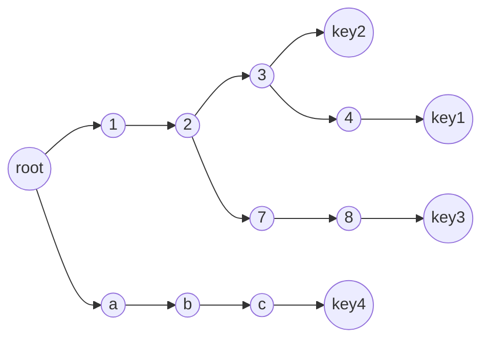
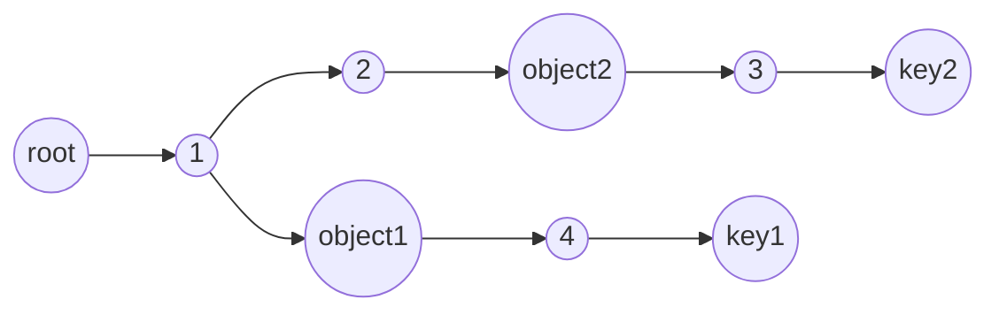
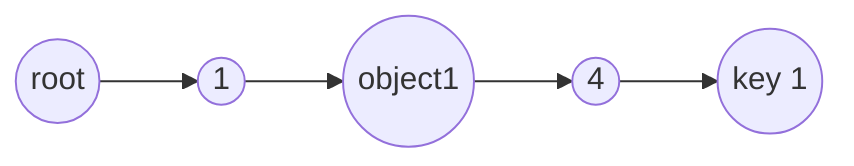
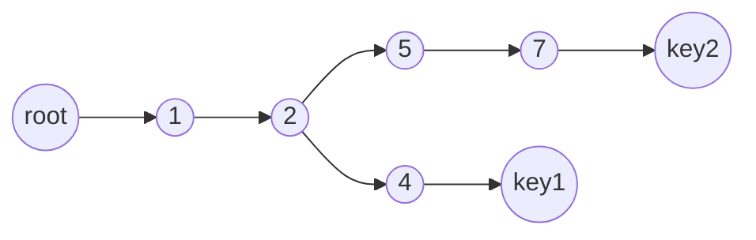
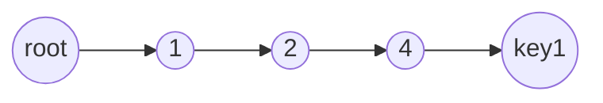

Have you ever wanted to use [tuples](https://www.typescriptlang.org/docs/handbook/2/objects.html#tuple-types) or objects for the keys of a [`Map`](https://developer.mozilla.org/en-US/docs/Web/JavaScript/Reference/Global_Objects/Map) or the values of a [`Set`](https://developer.mozilla.org/en-US/docs/Web/JavaScript/Reference/Global_Objects/Set)? It's a [very](https://stackoverflow.com/questions/43592760/typescript-javascript-using-tuple-as-key-of-map) [common](https://stackoverflow.com/questions/21838436/map-using-tuples-or-objects) [question](https://stackoverflow.com/questions/63179867/set-of-tuples-in-javascript) because the following code doesn't do what you might expect:

```js
const map = new Map()
map.set([1, 2], 3)
console.log(map.get([1, 2]))
//=> undefined

const set = new Set()
set.add([1, 2])
console.log(set.has([1, 2]))
//=> false
```

The code behaves this way because a `Map`'s keys and a `Set`'s values are compared using reference equality, as specified by the [SameValueZero algorithm](https://developer.mozilla.org/en-US/docs/Web/JavaScript/Reference/Global_Objects/Map#key_equality). Two deeply equal arrays are not _referentially_ equal:

<!-- eslint-skip -->

```js
console.log([1, 2] === [1, 2])
//=> false
```

The following code behaves more predictably:

```js
// A reference to a single array instance!
const tuple = [1, 2]

const map = new Map()
map.set(tuple, 3)
console.log(map.get(tuple))
//=> 3

const set = new Set()
set.add(tuple)
console.log(set.has(tuple))
//=> true
```

But that isn't particularly useful because typically you're constructing tuples on the fly using values from some external source:

```js
const f = (x, y) => {
  // This will return undefined because `[x, y]` is a new array!
  const value = map.get([x, y])

  // ...
}
```

A common solution is to use [`JSON.stringify`](https://developer.mozilla.org/en-US/docs/Web/JavaScript/Reference/Global_Objects/JSON/stringify):

```js
const map = new Map()
map.set(JSON.stringify([1, 2]), 3)
console.log(map.get(JSON.stringify([1, 2])))
//=> 3

const set = new Set()
set.add(JSON.stringify([1, 2]))
console.log(set.has(JSON.stringify([1, 2])))
//=> true
```

This works because strings are primitives, which are compared by value rather than by reference. Unfortunately, using `JSON.stringify` requires that the inner values are stringifiable. If they're not, then you're forced to write a custom serialization function.

Plus, sometimes you _do_ want reference equality, per inner value, but serialization doesn't preserve reference equality:

```js
const person1 = { name: `Tomer`, occupation: `Software Engineer` }
const person2 = { name: `Tomer`, occupation: `Software Engineer` }

const salaryApplications = new Map()
salaryApplications.set(JSON.stringify([person1, Number.MAX_VALUE]), `approved`)

// Oh no! Two different software engineers named Tomer are considered the same due to stringifying!
console.log(salaryApplications.get(JSON.stringify([person2, Number.MAX_VALUE])))
//=> approved
```

Surely there's a better way!

## The solution: `keyalesce`

[`keyalesce`](https://github.com/TomerAberbach/keyalesce) is a module that returns the same unique key for the same value sequence[^1]. It's perfect for this use case:

<!-- eslint-skip -->

```js
const person1 = { name: `Tomer`, occupation: `Software Engineer` }
const person2 = { name: `Tomer`, occupation: `Software Engineer` }

const map = new Map()
map.set(keyalesce([1, 2]), 3)
map.set(keyalesce([2, `b`, 3]), 4)
map.set(keyalesce([person1, Number.MAX_VALUE]), `approved`)
map.set(keyalesce([person2, Number.MAX_VALUE]), `totally approved`)

console.log(map.get(keyalesce([1, 2])))
//=> 3

console.log(map.get(keyalesce([2, `b`, 3])))
//=> 4

console.log(map.get(keyalesce([person1, Number.MAX_VALUE])))
//=> approved

console.log(map.get(keyalesce([person2, Number.MAX_VALUE])))
//=> totally approved

const set = new Set()
set.add(keyalesce([1, 2, 3, 4, 5]))
set.add(keyalesce([3, 3, 2, 2, 1]))

console.log(set.has(keyalesce([1, 2, 3, 4, 5])))
//=> true

console.log(set.has(keyalesce([3, 3, 2, 2, 1])))
//=> true

console.log(keyalesce([1, 2, 3, 4, 5]) === keyalesce([1, 2, 3, 4, 5]))
//=> true
```

## How does it work?

`keyalesce` internally maintains a [trie](https://en.wikipedia.org/wiki/Trie) containing the sequences of values it has been called with. It creates and returns new keys for new sequences and returns previously created keys for known sequences!

For example, the following code:

```js
const key1 = keyalesce([1, 2, 3, 4])
const key2 = keyalesce([1, 2, 3])
const key3 = keyalesce([1, 2, 7, 8])
const key4 = keyalesce([`a`, `b`, `c`])
```

Would result in the following trie:



And calling `keyalesce([1, 2, 3, 4])` again would return `key1` after traversing nodes `1`, `2`, `3`, and `4` in the trie.

### Does `keyalesce` cause memory leaks?

A long running program using a naive implementation of `keyalesce` would have a [memory leak](https://en.wikipedia.org/wiki/Memory_leak) due to unbounded growth of the trie. How are [unreachable](https://en.wikipedia.org/wiki/Unreachable_memory) nodes pruned?

#### Sequence value reachability

Consider the following code:

```js
const object1 = {}
const object2 = {}

const key1 = keyalesce([1, object1, 4])
const key2 = keyalesce([1, 2, object2, 3])

// ...
```

Which would result in the following trie:



If the code continues like so:

```js
object2 = null
```

Then `object2`'s original value is only reachable from the trie. `keyalesce` can now prune the associated sequence and its key from the trie because it has become _impossible_ for `keyalesce` to be called with that sequence ever again.

I made the trie hold only [weak references](https://en.wikipedia.org/wiki/Weak_reference) to objects passed to `keyalesce` and pruned the trie when the objects are [garbage-collected](<https://en.wikipedia.org/wiki/Garbage_collection_(computer_science)>) using [`FinalizationRegistry`](https://developer.mozilla.org/en-US/docs/Web/JavaScript/Reference/Global_Objects/FinalizationRegistry).

After pruning in this case the trie would look like so:



:::note
Although `1` was in the sequence it was not pruned because it is still needed for another sequence.
:::

#### Created key reachability

Consider the following code:

```js
const key1 = keyalesce([1, 2, 4])
const key2 = keyalesce([1, 2, 5, 7])

// ...
```

Which would result in the following trie:



The previous section's logic does not apply because all of the sequence values are primitives, which are always reachable and not eligible for garbage collection. So how is the trie pruned in this case?

If the code continues like so:

```js
key2 = null
```

Then `key2`'s original value is only reachable from the trie. Although it's still possible to call `keyalesce` with `[1, 2, 5, 7]`, `keyalesce` can actually prune the key and its associated value sequence because there isn't any code that depends on receiving that specific key anymore. `keyalesce` doesn't need to return the same unique key
for a given value sequence. It only needs to prevent multiple keys existing _simultaneously_ for the same value sequence.

Similarly to the handling of object sequence values, I made the trie hold only weak references to created keys and pruned the trie when the keys are garbage-collected using `FinalizationRegistry`.

After pruning in this case the trie would look like so:



:::note
Although `1` was in the sequence it was not pruned because it is still needed for another sequence.
:::

In summary, the trie is pruned whenever object sequence values or keys have only weak references to them.

## Go use it!

Install [`keyalesce`](https://github.com/TomerAberbach/keyalesce):

```sh
$ npm i keyalesce
```

And import it:

```js
import keyalesce from 'keyalesce'

const hangouts = new Set()

const createHangoutKey = (person1, person2) =>
  keyalesce([person1, person2].sort())
const hangOut = (person1, person2) =>
  hangouts.add(createHangoutKey(person1, person2))
const didTheyHangOut = (person1, person2) =>
  hangouts.has(createHangoutKey(person1, person2))

hangOut(`Tomer`, `Sam`)
hangOut(`Tomer`, `Amanda`)

console.log(didTheyHangOut(`Tomer`, `Sam`))
console.log(didTheyHangOut(`Sam`, `Tomer`))
//=> true
//=> true

console.log(didTheyHangOut(`Tomer`, `Amanda`))
console.log(didTheyHangOut(`Amanda`, `Tomer`))
//=> true
//=> true

console.log(didTheyHangOut(`Sam`, `Amanda`))
console.log(didTheyHangOut(`Amanda`, `Sam`))
//=> false
//=> false
```

[^1]: Two value sequences are considered equal if each of their values are equal using the [SameValueZero algorithm](https://developer.mozilla.org/en-US/docs/Web/JavaScript/Reference/Global_Objects/Map#key_equality).
