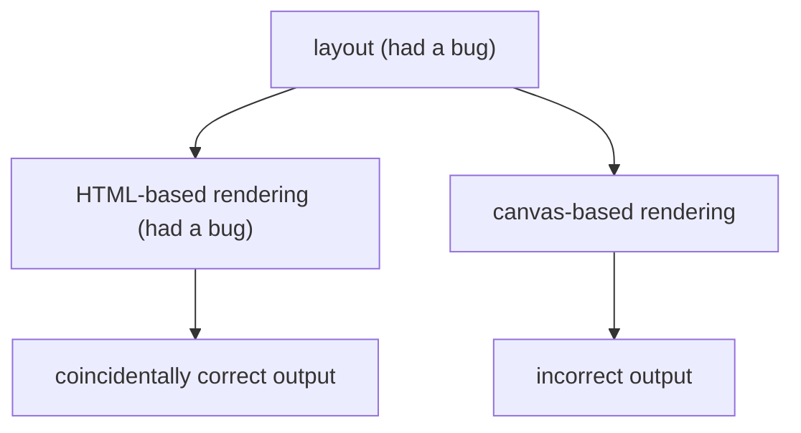

I encountered an interesting bug while implementing [table cell splitting in Google Docs](https://workspaceupdates.googleblog.com/2022/10/split-table-cells-in-google-docs.html).

## The bug report

The QA team found a bug where in certain scenarios some of a table's borders would be missing after a table cell split. However, the borders reappeared on refreshing the page. That meant the document's data was likely stored correctly and that [incremental](https://en.wikipedia.org/wiki/Incremental_computing) layout or rendering had a bug.

## The investigation

At the time, the team was [migrating Google Docs from HTML-based rendering to canvas-based rendering](https://workspaceupdates.googleblog.com/2021/05/Google-Docs-Canvas-Based-Rendering-Update.html). QA reported the bug about a canvas-rendered document so I tried to reproduce the issue on an HTML-rendered document. The issue did not reproduce!

At this point I concluded the new canvas-based rendering must have a bug. Oh how wrong I was... After _much_ investigation I realized canvas-based rendering was correct.

## Two bugs

In Google Docs, the output of layout is the input for rendering. It turned out layout had a bug and canvas-based rendering was displaying the incorrect output correctly. So why did HTML-based rendering look correct? It turned out that HTML-based rendering _also_ had a bug and the bug coincidentally "fixed" layout's output so that the final output looked correct.

